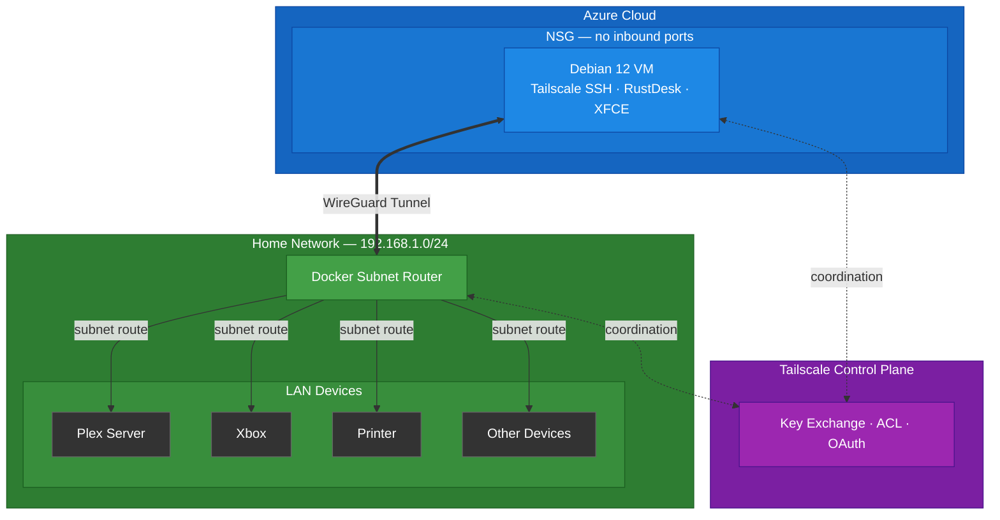

# Tailscale Subnet Router Lab

A practical demonstration of Tailscale subnet routing — securely accessing an entire home network from an Azure VM with no port forwarding, no VPN appliances, and no per-device configuration.

## Architecture



## How It Works

A Docker container on the home network runs Tailscale as a subnet router, advertising the local LAN (e.g., `192.168.1.0/24`) to the tailnet. An Azure VM, also joined to the same tailnet, runs `--accept-routes` so it can reach devices on the home network. All traffic between the two flows through encrypted WireGuard tunnels — no port forwarding or traditional VPN infrastructure required. The Tailscale control plane handles key exchange, NAT traversal, and access control.

The VM is accessed exclusively through **Tailscale SSH** — no public IP, no SSH port exposed, no inbound NSG rules. An XFCE desktop environment, Firefox, and RustDesk are installed via an Azure VM extension for GUI-based demos (e.g., accessing Plex hosted in the home network).

## What This Demonstrates

- **Subnet routing** — A Docker container on the home network advertises `192.168.1.0/24` to the tailnet, giving any tailnet device access to the entire LAN
- **Infrastructure as code** — Terraform provisions the Azure VM, networking, and Tailscale auth via the [tailscale/tailscale/cloudinit](https://registry.terraform.io/modules/tailscale/tailscale/cloudinit/latest) module; Docker Compose runs the subnet router
- **Zero-trust networking** — No inbound ports opened, no public IP on the VM. Access is exclusively via Tailscale SSH
- **OAuth-based provider auth** — The Tailscale Terraform provider uses OAuth client credentials (not user-scoped API keys) for machine-to-machine automation
- **ACL-driven route approval (optional)** — `autoApprovers` in the Tailscale ACL policy can auto-approve subnet routes from devices tagged `tag:subnet-router`, eliminating manual admin steps
- **End-to-end validation** — A validation script verifies connectivity from the Azure VM through the subnet route to home LAN devices

## Project Structure

```
.
├── terraform/                        # Azure VM + networking (IaC)
│   ├── main.tf                       # Root module: providers, resource group, Tailscale auth key
│   ├── variables.tf                  # Input variables
│   ├── outputs.tf                    # VM name output
│   ├── terraform.tfvars.example      # Example variable values
│   └── modules/
│       ├── network/                  # VNet, subnet, NSG (no inbound rules)
│       ├── tailscale-ssh-node/       # Debian 12 VM with Tailscale via cloud-init
│       └── desktop-environment/      # XFCE + RustDesk + Firefox via Azure VM extension
├── docker/                           # Subnet router (home network)
│   ├── docker-compose.yml            # Tailscale container config
│   └── .env.example                  # Auth key, routes, and extra args
├── scripts/
│   └── validate.sh                   # End-to-end connectivity checks
└── docs/
    └── architecture.mmd              # Mermaid diagram source
```

## Prerequisites

- [Tailscale account](https://login.tailscale.com) with a personal tailnet
- [Terraform](https://developer.hashicorp.com/terraform/install) >= 1.0
- An active [Azure subscription](https://azure.microsoft.com/en-us/free/)
- [Azure CLI](https://learn.microsoft.com/en-us/cli/azure/install-azure-cli) authenticated (`az login`)
- [Docker](https://docs.docker.com/get-docker/) and Docker Compose on the home network machine
- A Tailscale OAuth client (see [Tailscale OAuth setup](#3-create-tailscale-oauth-client))
- An Azure VM SKU available in your chosen region (default: `Standard_D2s_v3` in `eastus`). Verify availability with:
  ```bash
  az vm list-skus --location eastus --size Standard_D2s_v3 --output table
  ```

## Setup

```bash
git clone https://github.com/mwmardis/tailscale-subnet-router-lab.git
cd tailscale-subnet-router-lab
```

### 1. Configure Tailscale ACL

Add the following to your [ACL policy](https://login.tailscale.com/admin/acls/file):

```json
"tagOwners": {
    "tag:subnet-router": ["autogroup:admin"],
    "tag:vm-lab": ["autogroup:admin"]
},

"ssh": [
    {
        "action": "accept",
        "src":    ["autogroup:admin"],
        "dst":    ["tag:vm-lab"],
        "users":  ["autogroup:nonroot"]
    }
],

"autoApprovers": {
    "routes": {
        "192.168.1.0/24": ["tag:subnet-router"]
    }
}
```

This:
- Allows admin users to SSH into VMs tagged `tag:vm-lab` via Tailscale SSH
- Auto-approves subnet routes from the Docker subnet router (optional — you can approve manually instead)

### 2. Deploy the Subnet Router (Home Network)

```bash
cd docker
cp .env.example .env
```

Edit `.env` with your values:
- `TS_AUTHKEY` — Generate an auth key at [Tailscale Admin > Settings > Keys](https://login.tailscale.com/admin/settings/keys). If using `autoApprovers`, create the key with the `tag:subnet-router` tag.
- `TS_ROUTES` — The CIDR range of your home subnet (e.g., `192.168.1.0/24`)
- `TS_EXTRA_ARGS` — Optional flags like `--advertise-tags=tag:subnet-router --accept-dns=false`

```bash
docker compose up -d
```

Verify the container joined the tailnet:

```bash
docker exec tailscale-subnet-router tailscale status
```

If not using `autoApprovers`, approve the subnet route in the [Tailscale admin console](https://login.tailscale.com/admin/machines) under the subnet router machine.

### 3. Create Tailscale OAuth Client

The Terraform provider authenticates via OAuth (not API keys).

1. Go to [Tailscale Admin > Settings > OAuth clients](https://login.tailscale.com/admin/settings/oauth)
2. Create a new OAuth client with description (e.g., "Terraform Lab Provisioning")
3. Set scope: **Auth Keys — Write**
4. Assign tag: `tag:vm-lab`
5. Save the client ID and client secret

### 4. Deploy the Azure VM

```bash
cd terraform
cp terraform.tfvars.example terraform.tfvars
```

Edit `terraform.tfvars` with your values:
- `tailscale_oauth_client_id` — OAuth client ID from step 3
- `tailscale_oauth_client_secret` — OAuth client secret from step 3
- `admin_username` — Username for the VM (default: `azureuser`)

```bash
az login
terraform init
terraform plan
terraform apply
```

Terraform will:
1. Create a resource group, VNet, subnet, and NSG (no inbound rules) in Azure
2. Generate a pre-authorized Tailscale auth key tagged `tag:vm-lab`
3. Provision a Debian 12 VM with cloud-init that installs **Tailscale** with SSH and accept-routes enabled (via [tailscale/tailscale/cloudinit](https://registry.terraform.io/modules/tailscale/tailscale/cloudinit/latest) module)
4. Install the desktop environment via an Azure VM extension (~6-7 minutes):
   - **XFCE desktop** with LightDM and auto-login
   - **Firefox ESR** browser
   - **RustDesk** for remote desktop demos through the subnet router
5. SSH key auth is auto-generated (no password needed — access is via Tailscale SSH)

The VM has **no public IP**. All access is through the Tailscale network.

### 5. Connect to the VM

Wait ~2 minutes for Tailscale to install. The desktop environment installs separately via an Azure VM extension (~6-7 minutes) and the VM reboots automatically when complete.

```bash
# Check if the VM has joined the tailnet
tailscale status

# SSH in via Tailscale
tailscale ssh <admin_username>@tailscalevm
```

To watch cloud-init progress in real time, open the **Serial Console** in the Azure portal:

**Azure portal → Virtual Machines → tailscale-lab-vm → Help → Serial console**

To monitor the desktop install progress:

```bash
sudo tail -f /var/lib/waagent/custom-script/download/0/stdout
```

Once XFCE and RustDesk finish installing, the VM reboots automatically and LightDM starts with auto-login enabled (no password required).

#### RustDesk Access

After LightDM is running:

```bash
sudo rustdesk --get-id
sudo rustdesk --password <your-chosen-password>
```

Use the ID and password in RustDesk on your local machine to connect to the VM's desktop through the Tailscale network.

### 6. Validate

Before running the validation script, update the device IPs in `scripts/validate.sh` to match your LAN/Tailnet:

```bash
# ── Configure these for your environment ──
SUBNET_ROUTER_HOSTNAME="${SUBNET_ROUTER_HOSTNAME:-home-subnet-router}"
PLEX_IP="${PLEX_IP:-192.168.1.169}"
PLEX_PORT="${PLEX_PORT:-32400}"
PRINTER_IP="${PRINTER_IP:-192.168.1.223}"
XBOX_IP="${XBOX_IP:-192.168.1.222}"
TAILNET_NAME="${TAILNET_NAME:-bee-massometer.ts.net}"
```

Replace the default IPs with the addresses of devices on your home network. You can also override them inline via environment variables without editing the file.

Run the validation script from your local machine:

```bash
cat scripts/validate.sh | sed 's/\r$//' | tailscale ssh <admin_username>@tailscalevm 'bash -s'
```

> **Note:** The `sed` command strips Windows line endings. The script uses `sudo` for network commands due to Tailscale SSH non-interactive session limitations.

This checks:
- Tailscale daemon is running and authenticated
- Subnet router is reachable via Tailscale
- Home LAN devices (printer, Xbox, Plex server) are pingable through the subnet route
- Plex Web UI responds over HTTP
- Traffic is routed through `tailscale0` via the subnet router
- VM is a member of the expected tailnet

### Important: Local Machine Configuration

If your local machine runs Tailscale **and** is on the same LAN as the subnet router, disable accept-routes locally:

```bash
tailscale set --accept-routes=false
```

Otherwise, your local machine routes LAN traffic through Tailscale instead of directly over the LAN, creating a routing loop. Only the Azure VM needs `--accept-routes=true`.

## Teardown

```bash
# Remove the Azure VM and all associated resources
cd terraform
terraform destroy

# Stop the subnet router
cd docker
docker compose down
```

## Security Notes

- **No secrets in the repo** — OAuth credentials, passwords, and tfvars are gitignored. Only `.example` files are committed.
- **No public IP** — The VM has no public IP address and no inbound NSG rules. All access is via Tailscale SSH.
- **OAuth client credentials** — The Tailscale provider uses scoped OAuth clients instead of user-tied API keys.
- **Pre-authorized, single-use keys** — The Terraform-managed auth key is non-reusable, ephemeral, and expires after 1 hour.
- **SSH key auth** — Azure VM uses an auto-generated RSA key pair (via `tls_private_key`). No password authentication.
- **Tagged devices** — The VM is tagged `tag:vm-lab` for ACL-controlled access. SSH access requires explicit ACL rules.
- **Persistent identity** — The VM uses a persistent Tailscale identity that survives reboots (required for the automated desktop install reboot). The subnet router persists state in a Docker volume, surviving container restarts without re-authentication.
