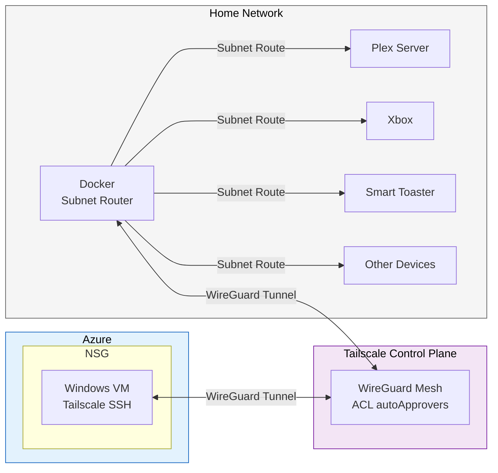

# Tailscale Subnet Router Lab

A practical demonstration of Tailscale subnet routing — securely accessing an entire home network from an Azure VM with no port forwarding, no VPN appliances, and no per-device configuration.

## Architecture



## How It Works

A Docker container on the home network runs Tailscale as a subnet router, advertising the local LAN (e.g., `192.168.1.0/24`) to the tailnet. An Azure VM, also joined to the same tailnet, runs `--accept-routes` so it can reach devices on the home network. All traffic between the two flows through encrypted WireGuard tunnels — no port forwarding or traditional VPN infrastructure required. The Tailscale control plane handles key exchange, NAT traversal, and access control.

## What This Demonstrates

- **Subnet routing** — A Docker container on the home network advertises `192.168.1.0/24` to the tailnet, giving any tailnet device access to the entire LAN
- **Infrastructure as code** — Terraform provisions the Azure VM, networking, and Tailscale auth; Docker Compose runs the subnet router
- **Zero-trust networking** — No inbound ports opened for Tailscale; the VM uses WireGuard tunnels via outbound-only DERP/STUN connections
- **ACL-driven route approval (optional)** — `autoApprovers` in the Tailscale ACL policy can auto-approve subnet routes from devices tagged `tag:subnet-router`, eliminating manual admin steps
- **End-to-end validation** — A validation script verifies connectivity from the Azure VM through the subnet route to home LAN devices

## Project Structure

```
.
├── terraform/                        # Azure VM + networking (IaC)
│   ├── main.tf                       # Root module: providers, resource group, Tailscale auth key
│   ├── variables.tf                  # Input variables
│   ├── outputs.tf                    # VM name and public IP
│   ├── terraform.tfvars.example      # Example variable values
│   └── modules/
│       ├── network/                  # VNet, subnet, NSG with RDP rule
│       └── tailscale-ssh-node/       # Windows VM with Tailscale auto-install
├── docker/                           # Subnet router (home network)
│   ├── docker-compose.yml            # Tailscale container config
│   └── .env.example                  # Auth key, routes, and extra args
├── scripts/
│   └── validate.sh                   # End-to-end connectivity checks
└── docs/
    └── architecture.mmd              # Mermaid diagram source
```

## Prerequisites

- [Tailscale account](https://login.tailscale.com) with a personal tailnet
- [Terraform](https://developer.hashicorp.com/terraform/install) >= 1.0
- An active [Azure subscription](https://azure.microsoft.com/en-us/free/)
- [Azure CLI](https://learn.microsoft.com/en-us/cli/azure/install-azure-cli) authenticated (`az login`)
- [Docker](https://docs.docker.com/get-docker/) and Docker Compose on the home network machine
- A Tailscale API key for the Terraform provider (`TAILSCALE_API_KEY` env var)

## Setup

```bash
git clone https://github.com/mwmardis/tailscale-subnet-router-lab.git
cd tailscale-subnet-router-lab
```

### 1. (Optional) Configure Tailscale ACL Auto-Approval

By default, subnet routes must be manually approved in the [Tailscale admin console](https://login.tailscale.com/admin/machines). To auto-approve routes, add the following to your [ACL policy](https://login.tailscale.com/admin/acls/file):

```json
"tagOwners": {
    "tag:subnet-router": ["autogroup:admin"]
},

"autoApprovers": {
    "routes": {
        "192.168.1.0/24": ["tag:subnet-router"]
    }
}
```

If you skip this step, you will need to manually approve the subnet route in the admin console after deploying the subnet router.

### 2. Deploy the Subnet Router (Home Network)

```bash
cd docker
cp .env.example .env
```

Edit `.env` with your values:
- `TS_AUTHKEY` — Generate an auth key at [Tailscale Admin > Settings > Keys](https://login.tailscale.com/admin/settings/keys). If using `autoApprovers`, create the key with the `tag:subnet-router` tag.
- `TS_ROUTES` — The CIDR range of your home subnet (e.g., `192.168.1.0/24`)
- `TS_EXTRA_ARGS` — Optional flags like `--advertise-tags=tag:subnet-router --accept-dns=false`

```bash
docker compose up -d
```

Verify the container joined the tailnet:

```bash
docker exec tailscale-subnet-router tailscale status
```

### 3. Deploy the Azure VM

```bash
cd terraform
cp terraform.tfvars.example terraform.tfvars
```

Edit `terraform.tfvars` with your values:
- `admin_password` — Password for RDP access to the VM
- `allowed_rdp_cidr` — Your public IP in CIDR notation (run `curl -s ifconfig.me` and append `/32`)

```bash
export TAILSCALE_API_KEY="tskey-api-..."
terraform init
terraform plan
terraform apply
```

Terraform will:
1. Create a resource group, VNet, subnet, and NSG in Azure
2. Provision a Windows 11 Pro VM
3. Generate a pre-authorized Tailscale auth key
4. Install Tailscale on the VM and authenticate it to your tailnet via a CustomScriptExtension

### 4. Validate

From the Azure VM (via Tailscale SSH or RDP), run the validation script:

```bash
tailscale ssh azureuser@tailscale-lab-vm 'bash -s' < scripts/validate.sh
```

This checks:
- Tailscale daemon is running and authenticated
- Subnet router is reachable via Tailscale
- Home LAN devices (gateway, Plex server) are reachable through the subnet route
- Plex Web UI responds over HTTP
- VM is a member of the expected tailnet

## Teardown

```bash
# Remove the Azure VM and all associated resources
cd terraform
terraform destroy

# Stop the subnet router
cd docker
docker compose down
```

## Security Notes

- **No secrets in the repo** — Auth keys, passwords, and tfvars are gitignored. Only `.example` files are committed.
- **NSG restricts RDP** — Inbound RDP (port 3389) is limited to a single CIDR you specify. Tailscale itself requires no inbound ports.
- **Pre-authorized, single-use keys** — The Terraform-managed auth key is non-reusable and expires after 1 hour. The Docker subnet router key can be configured independently.
- **Ephemeral vs. persistent** — The VM uses a persistent Tailscale identity. The subnet router persists state in a Docker volume, surviving container restarts without re-authentication.
